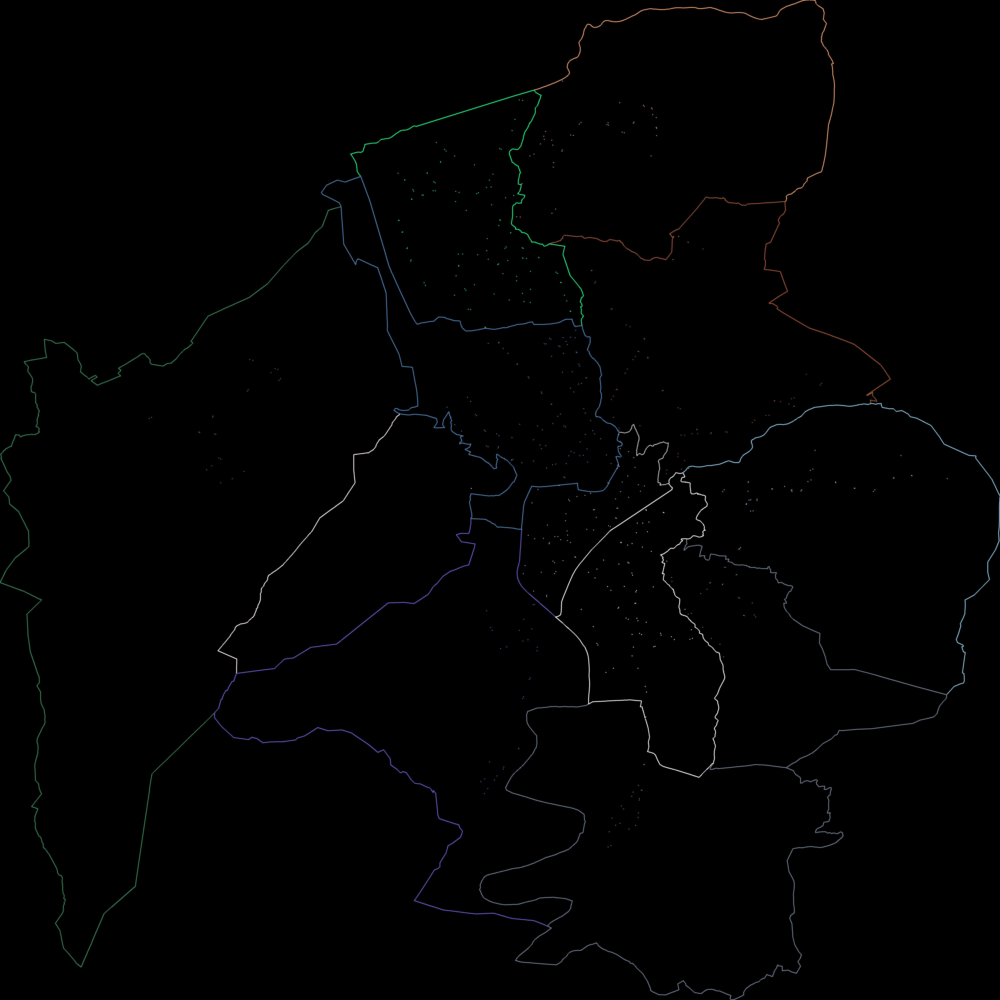
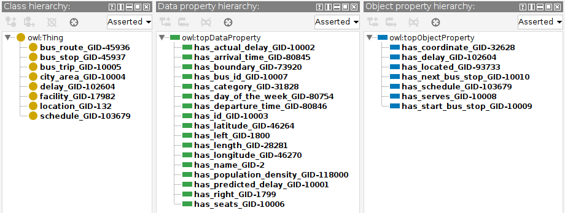
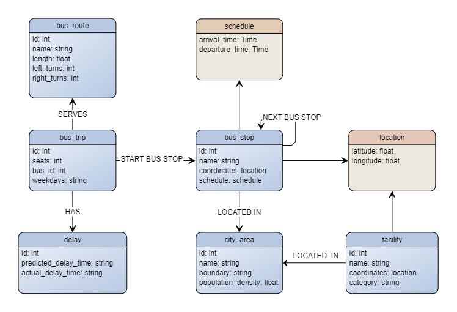

# Trentino Urban Transportation

Authors: Eugenio Ferrari and Rubens Rissi Onzi

Contact Information: [Eugenio Ferrari](eugenio.ferrari-1@studenti.unitn.it), [Rubens Rissi Onzi](rubens.rissionzi@unitn.studenti.it)

## Introduction

This project aims at producing useful data for applications that intend to tell it's users about possible delays using the data we provide.
The data will feature details mainly about bus stops locations

where every point is a bus stop using it's territory data. With that benefiting Trento inhabitants of urban areas.

We also added facillity that could bring delays

where every point is a facillity

## Purpose

 The goal of this project is to provide data to applications and services that need information suitable for predicting bus delays. To do so, we want to incorporate data that could affect transportation delays in urban areas, more in detail. We will consider supermarkets, catering stores, education facilities, tourism destinations, population density, number of right and left turns and number of traffic signs. Relevant features to predict delays: [Link](https://journals.sagepub.com/doi/abs/10.3141/1666-12}).

## Knowledge Resources

Given the teleology created and the lightweight ontology identified, we derived a teleontology in Protégé, in the following image we report a diagram representing the results of the knowledge phase.

- bus stop
- city area
- delay
- facility
- bus route
- schedules
- bus trip

## ER Model

Given the entities and property identified in the step above, we can design the purpose ER
model as in the following Figure.

## Data

The raw data from the project can be found at this repository at [raw data](assets/images/ER_model.png) and the knoledge graphs at .

## Report

[Report](Documentation/KGE_2023___Project_Report.pdf)

## GitHub

[https://github.com/R-R-Onzi/TTT_KGE](https://github.com/R-R-Onzi/TTT_KGE)
